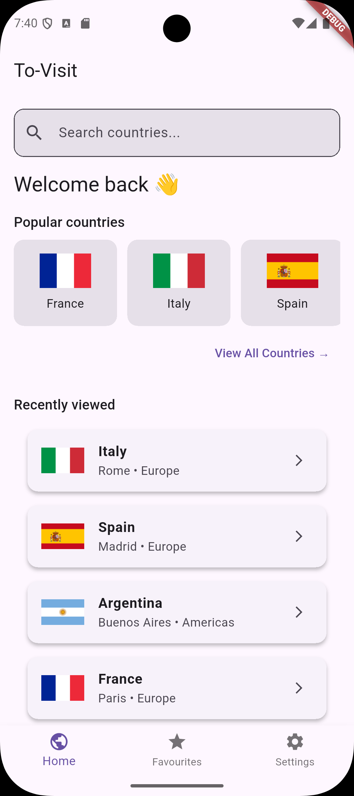
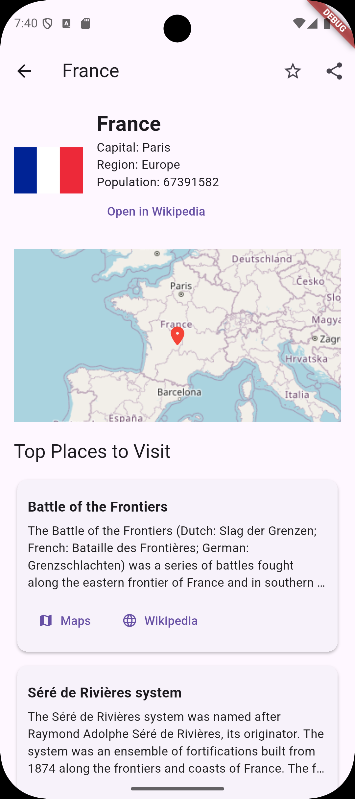
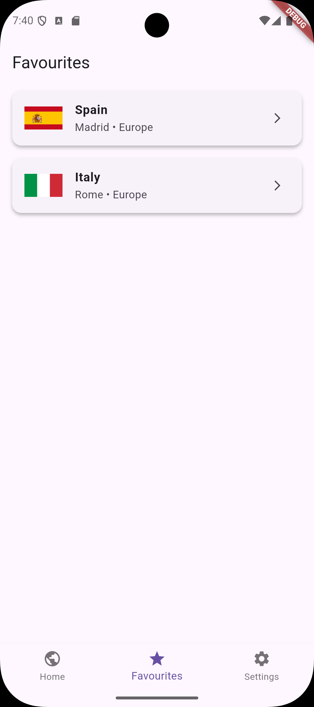
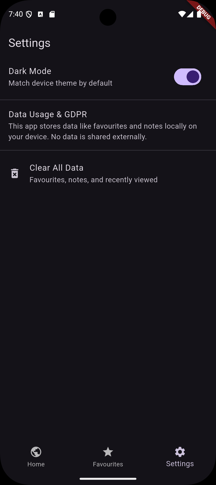

# 📍 ToVisit: Explore the World

A Flutter-based travel discovery app that helps users learn about countries and plan their dream visits. Users can browse, search, and favourite countries, view popular points of interest, write notes, and explore interactive maps — all in one smooth mobile experience.

---

## 🚀 Introduction

ToVisit is a mobile application designed for users to explore countries around the world. The app provides:

- 🌍 Country information (flag, capital, region, population)
- 🏞️ Top places to visit with map markers
- 📝 Personal notes for each country
- ⭐ Favouriting feature
- 🔍 Country search and popular previews
- 📌 Recently viewed history
- 🗺️ Map with tappable POI markers
- 🌗 Dark/Light theme support
- 🔗 Wikipedia and Google Maps integration
- 📤 Share notes with others
- 📸 POI images (if available)
- 🔄 Pull to refresh
- ⚙️ Settings and GDPR explanation

No account or internet is required for previously viewed countries — ensuring quick offline access.

---

### 📸 App Screenshots

<table>
  <tr>
    <td><strong>🏠 Home Screen</strong></td>
    <td></td>
  </tr>
  <tr>
    <td><strong>🌍 Country Detail</strong></td>
    <td></td>
  </tr>
  <tr>
    <td><strong>⭐ Favourites</strong></td>
    <td></td>
  </tr>
  <tr>
    <td><strong>⚙️ Settings</strong></td>
    <td></td>
  </tr>
</table>

---

## 🛠️ Design Rationale

### Architecture
- **Flutter** was chosen for its modern cross-platform capabilities and rich UI libraries.
- The app uses **multiple screens**: Home, Country Detail, All Countries, Favourites, Settings, and POI Detail.
- Navigation is handled via Flutter’s **Navigator 2.0** with named routes.
- Data is passed using `arguments` and explicit routing.

### UI & Layout
- Main layouts use `Column`, `ListView`, and `FlutterMap` widgets.
- **RecyclerView-equivalent** functionality is achieved via `ListView.builder` and `GridView`.
- Menus are implemented using `PopupMenuButton` and contextually displayed settings tiles.
- The bottom navigation bar enables quick screen switching.

### Data & Storage
- `SharedPreferences` is used for:
  - Notes per country
  - Favourited countries
  - Recently viewed history
  - Theme preference
- JSON from REST APIs is parsed into local Dart model classes (`Country`, `Place`).

---

## 💡 Novel Features

- ✅ Wikipedia & Maps integration using **implicit intents**
- ✅ Full POI Detail screen with image, map, and navigation links
- ✅ Persistent dark/light mode setting
- ✅ Offline support for viewed countries (stored in `SharedPreferences`)
- ✅ Real-time POI discovery using OpenTripMap API
- ✅ Pull to refresh & data loading spinners
- ✅ GDPR section in settings
- ✅ Notes export/share via native sharing

These features enhance user experience, meet and exceed the spec, and showcase advanced mobile development patterns.

---

## 🧩 Challenges and Future Improvements

### Challenges
- 🧭 Handling missing or non-English POI data from OpenTripMap
- 🗺️ Fitting map markers dynamically with country shapes
- 🧪 Managing navigation state between widgets and screens
- 🌐 Dealing with flaky API data (e.g. invalid JSON from country API)

### Future Improvements
- ✅ Multilingual support via `flutter_localizations`
- 🔐 Cloud sync with Firebase (for notes & favourites)
- 📊 Statistics screen (e.g. countries favourited, notes written)
- 🗂️ Save/export trips as collections
- 🧪 More unit/integration testing

---

## 📂 How to Use / Run

1. **Flutter SDK Required**  
   - Ensure Flutter is installed (`flutter doctor`)

2. **Run the App**
   ```bash
   flutter pub get
   flutter run
   ```

3. **Dependencies**  
   - OpenTripMap API (Free Key)
   - REST Countries API
   - Packages used:
     - `flutter_map`
     - `latlong2`
     - `shared_preferences`
     - `url_launcher`
     - `share_plus`
     - `connectivity_plus`

4. **Configuration Notes**
   - Ensure an internet connection is available on first load
   - If APIs fail, app falls back gracefully and caches recent data

---

## 📦 Project Structure

```
lib/
│
├── models/          → Country & Place models
├── screens/         → Home, Country, Settings, POI, etc.
├── services/        → API & storage helpers
├── widgets/         → Reusable UI components (cards, etc.)
├── main.dart        → App root, routing, theme
```

---

## 📃 GDPR Compliance

ToVisit does not collect or transmit any personal data. All data (favourites, notes, preferences) are stored locally using `SharedPreferences`. Users can delete all stored data from the **Settings > Clear Data** option.

---

## ✅ Core Requirement Checklist (From Spec)

| Spec Requirement                      | Implemented? |
|--------------------------------------|--------------|
| Multiple Screens & Navigation        | ✅ Yes        |
| Intents (explicit & implicit)        | ✅ Yes        |
| Menus & Intuitive UI                 | ✅ Yes        |
| RecyclerView equivalent              | ✅ Yes (ListView/Grid) |
| SharedPreferences                    | ✅ Yes        |
| Fully functional & launchable        | ✅ Yes        |
| README with design & challenges      | ✅ Yes        |

---

## 🧪 Testing

To ensure code reliability and functionality, the app includes a set of unit tests that validate model parsing and storage functionality.

### 📁 Tests Included

| File                              | What it tests                             |
|-----------------------------------|--------------------------------------------|
| `test/country_model_test.dart`    | Country model JSON parsing                 |
| `test/storage_service_test.dart` | Saving/retrieving notes and favourites     |

### ▶️ Running Tests

In the root of the project directory, run:

```bash
flutter test
```

You should see output like:

```
00:00 +2: All tests passed!
```

### 🧠 Why These Matter

- Verifies core logic like local note storage and country data handling
- Demonstrates adherence to best practices for Flutter development
- Easy to expand later with integration or widget tests

---

© 2025 
Author: Yousuf Ahmed
GitHub: https://github.com/yousufaahmed/To-Visit
LinkedIn: https://www.linkedin.com/in/yousufaahmed/

---

Created for ECM2425
